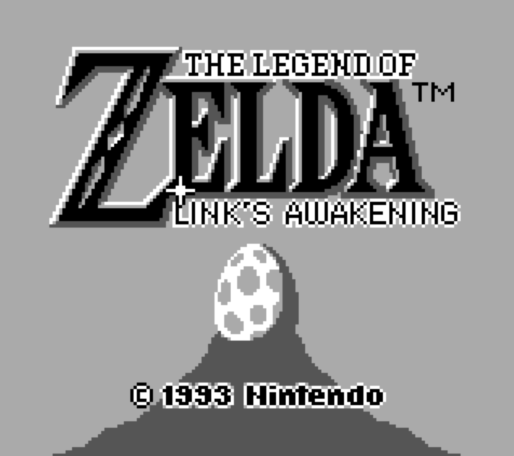

# Game Boy Emulator

A custom, work-in-progress original Nintendo Game Boy (DMG) emulator written from scratch in modern C++.

This project was built to understand the intricacies of low-level hardware emulation, cycle-accurate timing, and system architecture. It successfully boots the original Game Boy Boot ROM, passes major hardware test ROMs (like Blargg's CPU tests), and plays classic games like *Tetris*.



## Features
* **Custom CPU Core:** Fully implemented LR35902 instruction set with cycle-accurate NOP NOP interrupt dispatching.
* **Pixel Processing Unit (PPU):** Supports background rendering, the window overlay, 8x8/8x16 sprites, X/Y flipping, and accurate palette translation.
* **Memory Management Unit (MMU):** Handles internal routing for VRAM, WRAM, HRAM, Echo RAM, and restricted memory-mapped I/O zones.
* **Hardware Interrupts:** Fully functioning `IME`, `IE`, and `IF` registers supporting VBlank, LCD STAT, and Joypad interrupts.
* **Direct Memory Access (DMA):** Safe, hardware-accurate DMA OAM transfers for sprite rendering.
* **Boot ROM Support:** Watch the iconic Nintendo logo drop.
* **SDL2 Frontend:** Hardware-accelerated rendering and mapped keyboard inputs.

## Controls
The keyboard is currently mapped to the Game Boy Joypad as follows:

| Game Boy | Keyboard |
| :--- |:---------|
| **D-Pad** | WASD     |
| **A** | `P`      |
| **B** | `O`      |
| **Start** | `.`      |
| **Select** | `,`      |

## Building from Source

### Prerequisites
* A C++17 (or newer) compatible compiler (GCC, Clang, or MSVC)
* [CMake](https://cmake.org/) (3.10 or higher)
* [SDL2](https://www.libsdl.org/) development libraries

### macOS (using Homebrew)
```bash
brew install cmake sdl2
```
### Ubuntu / Debian:
```bash
sudo apt update
sudo apt install build-essential cmake libsdl2-dev
```
### Clone and Build
You can clone the repository and build the project directly from your terminal using CMake:
```bash
# 1. Clone the repository
git clone https://github.com/AndreasSabelfeld/gameboy_emulator
cd gameboy_emulator

# 2. Create a build directory and navigate into it
mkdir build
cd build

# 3. Generate the build files and compile
cmake ..
cmake --build .
```

### Running the Emulator
Once compiled, you can run the executable from the build directory (or your IDE's output folder like cmake-build-debug), passing the path to a ROM file as an argument:
```bash
./GameBoyFrontEnd ../roms/tetris.gb
```

# Important References & Documentation
Building an emulator requires standing on the shoulders of giants. A huge thanks to the community and the authors of the following documentation:

[The Pan Docs](https://gbdev.io/pandocs/) - The ultimate, comprehensive technical reference for Game Boy hardware.

[Game Boy Opcode Table](https://www.pastraiser.com/cpu/gameboy/gameboy_opcodes.html) - Invaluable visual cheat sheet for all LR35902 opcodes, cycles, and flag behaviors.

[The Cycle-Accurate Game Boy Docs](https://github.com/rockytriton/LLD_gbemu/raw/main/docs/The%20Cycle-Accurate%20Game%20Boy%20Docs.pdf) - Deep dive into exact hardware timings and NOP delays.

[GBCTR (Game Boy CPU Timer Register)](https://github.com/rockytriton/LLD_gbemu/raw/main/docs/gbctr.pdf) - Essential reading for getting the hardware timers perfectly accurate.

[Game Boy Programming Manual (Ver 1.1)](https://archive.org/details/GameBoyProgManVer1.1/page/n85/mode/2up) - The official, original Nintendo developer manual from the 1990s.